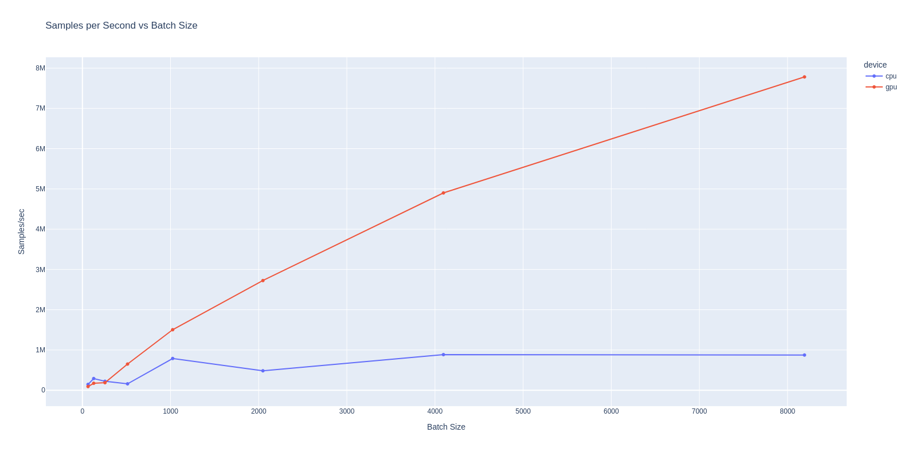

# Pure GPU Elevator Environment

This enviromment runs the classic game of ElevatorEnv purely on the GPU. This project was **LLM-coded** so watch out for 
any unexpected results.

To train:
```python train_elevator_env.py```

To test the speed:
```python speed_benchmark.py```

To watch the policy:
```python animation_of_policy.py```

#### Speed Comparison: CPU vs GPU

Running the environment on my puny GTX 1050 on my laptop. The GPU is unfortunately too old for compiling the torch code
but we still see decent speed ups.


